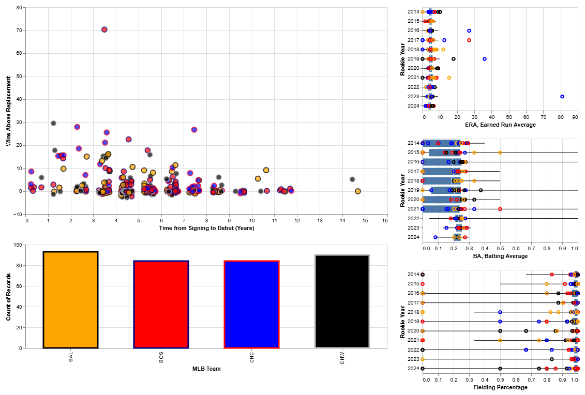
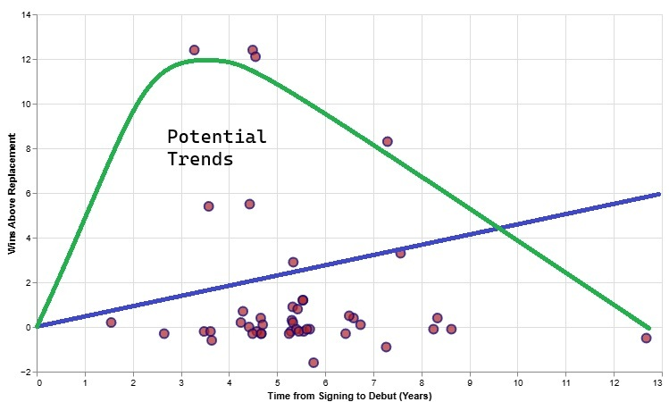
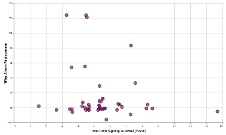
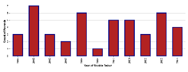
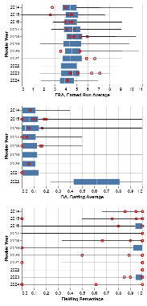
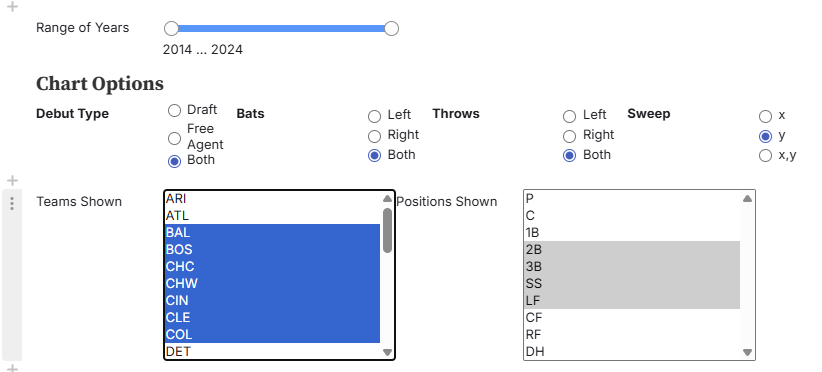

# Dashboard Final Report
### Robert Bumgarner
### Information Visualization
### CS 725, ODU, Spring 2025
## MLB Farm Team Assessment using WAR and Debut Timelines
[Dashboard Link](https://observablehq.com/@r-bumgarner/infovis-project-mlb-farm-system-analysis)

 - ## Introduction
Baseball is an excellent topic for an information visualization project due to its rich and structured data. The sport has a long-standing tradition of meticulous record-keeping, with statistics recorded for nearly every aspect of the game—from player performance metrics like batting average, on-base percentage, and strikeout rates, to team-based analytics such as win-loss records and run differentials. This wealth of data provides a fertile ground for creating detailed visual representations that can reveal patterns, trends, and insights over time. These trends can provide a valuable tool for teams to make strategic decisions with their player development, player acquisitions, or game strategies.

Moreover, baseball appeals to a broad audience, including fans, analysts, and fantasy sports enthusiasts, all of whom benefit from clear, engaging visualizations. Well-designed graphics can help explain complex statistical aggregations like Wins Above Replacement (WAR) or compare many players' performances in a more intuitive way. Interactive dashboards, heatmaps, spray charts, or pitch tracking plots can enhance the viewer’s understanding and appreciation of the sport’s nuances.

I can recall countless times when a baseball commentator during a baseball broadcast comments that 'the player hasn't had enough time in the minor leagues' when the new players appear to struggle in their new role. The MLB draft talent pipeline begins with amateur players—primarily high school and college athletes—who are scouted over several years through showcases, tournaments, and school seasons. Each summer, eligible players enter the MLB Draft, where teams select from this pool in reverse order of their teams' previous season’s standings. After being drafted, players typically sign contracts and begin their professional careers in the Minor League system, progressing through levels (Rookie, A, AA, AAA) based on performance and development needs. It is this development process (or lack thereof) which commentators tend to suggest is a cause for the players' apparent successes or failures.

It was my hope for this project to provide a data dashboard capable of demonstrating any MLB teams' ability to draft and develop player talent by showing a trend in increased overall player performance as the time from drafting to debut increases. Along with this displayed data, I hoped to include relevant fielding, pitching, and batting stats while also allowing a user to filter by important player characteristics such as handedness and positions played.

 - ## Data
The data for this project originates from 4 datasets from the www.baseball-reference.com page. 
 - [Rookie Stats](https://www.baseball-reference.com/leagues/majors/2021-rookies.shtml)
 Contains great info about WAR during the rookie year, draft times, and handedness for batting and throwing. The draft and debut dates are used in deriving a time-to-debut statistic which plots the x-axis of the main scatterplot. Positions in this dataset are quite convoluted with positions divided into those where the player played >60% of the season's games, at least 10 games, and less than 10 games. This field was difficult to parse and ended up as a truth table of consistently played positions as well as a single string representation of the players most played positions as digits 1-9 and D for designated hitting. Data spans 11 years of baseball stats (11 chosen for no particular reason) from 2014-2024. 
 - [Fielding Stats](https://www.baseball-reference.com/leagues/majors/2024-fielding-leaders.shtml)
 - [Pitching Stats](https://www.baseball-reference.com/leagues/majors/2024-pitching-leaders.shtml)
 - [Batting Stats](https://www.baseball-reference.com/leagues/majors/2024-batting-leaders.shtml)

These 3 last stat fields were joined to the modified rookie debut dataset as merged data frames. The site had a csv export option for each years table but not a comprehensive year-to-year dataset, so data downloading and joining all years was performed manually. Afterwards, data was merged via pandas dataframes merge() methods using a unified statistic which is the database's shortest possible player name to give them a unique identifier. Picture a string which names two John Smiths appropriately so they have unique identifiers with the least possible characters.

The scripts and raw data processed prior to upload to observable are all present here along with a SHAP analysis utilizing ML to derive the most influential predicters of a player's WAR:
[Link to Data Manipulation Zip](PythonWork.zip)

 - ## Visualization

 The dashboard possesses 5 total visualization elements outside of the interactive inputs included to filter data and change interactive behaviors:
 
 - **WAR vs. Debut Time Scatter Plot**
 This plot presents the user with a view of all players in the current dataset with their WAR stat as the vertical axis (a comprehensive aggregated stat of the players performance) and their time to debut. The debut time is measured in years as the time from their drafting or free agent signing to their first debut game in their rookie season. A sweeping filter is provided to allow the user to change the data displayed in the subsequent charts and a tooltip feature provides player name and displayed statistics for the mark hovered over. Users shift clicking the mark can also initiate a google search with the players, name, team, and rookie year.
 
 
 - **Player Counts by year -*or*- Player Counts by Team Bar Chart**
 This plot, depending on the number of teams present on the chart, denotes the number of players in the current filtered dataset. When the user sweeps through a section of the scatter plot, this plot changes to reflect counts in the selected region.
 
 
 - **Box and Whisker Plots with Key baseball Statistics and a Scatter Overlay**
 These plots denote a league-derived value by year for the box-and-whisker plot statistics displayed in each facet. Overlayed over each plot is a scatter mark for the filtered player values present in the current data set. Extra filtering is performed to ensure players who have not pitched do not show up in the ERA and pitchers who only pitch and do not bat are not displayed with a batting average. A tooltip allows further determination of the player mark shown. 
 
  
  
 - **Filtering Interactivity**
 The filters present allow the user to fine-tune the type of player they wish to view by team, position, handedness, talent source, and year of debut. The radio buttons are standard Input objects from observable but aligned by html div language to arrange them horizontally.
 The 'team' and 'position' selectable elements are also native observable elements with a div alignment similar to the radio buttons with parameters that permit for multiple selections to be made simultaneously. 
 
 - ## Design Decisions
	 - ### Visual Encodings
		 - ### **Scatter**
			 - **Marks/Spatial Channels**
				 - The marks are circles with outlines, which are simple geometric primitives optimal for representing individual data points.
				 - The vertical axis encodes WAR, a quantitative attribute, using position on the common scale (y-axis)—one of the most accurate and effective visual channels for comparing values.
				 - The horizontal axis shows time to debut, another quantitative variable, also encoded with horizontal position, enabling viewers to see trends, outliers, or clusters along career debut timelines.
			 - **Color and Categorical Encoding**
				 - This encoding supports pattern recognition for team-based trends—such as whether certain teams consistently produce higher-WAR players or have quicker development timelines.
				 - Color hue is used to represent team affiliation, a categorical variable. As Munzner explains, hue is an effective channel for categorical distinctions, allowing viewers to visually group players by origin team when multiple teams are present.
		 - ### **Bar**
			 - **Marks/Spatial Channels**
				 - The marks in this case are vertical bars, which are effective for displaying
				   aggregated quantities.
				 - The x-axis encodes the categorical attribute (team or debut years), separating each
				   category into distinct positional bins. Spatial
				   separation along one axis is a strong technique for organizing
				   discrete groups.				   
				  - The height of the bars encodes a quantitative value (number of
				   players) using vertical position and length, which are accurate visual channels for supporting comparison tasks between
				   groups.

			 - **Color and Categorical Encoding**
				- The color of each bar uses hue to match team identity. Hue is effective for differentiating categories, especially when viewers are already familiar with team colors, enhancing recognition and grouping.
				- This visual encoding reinforces the categorical distinction already established by x-axis separation—a technique known as redundant encoding, which improves robustness and interpretability.
		 -  ### Box and Whisker with Overlay
			 - **Marks, Axes, and Aggregation**
				 - The primary marks are box plots (composed of boxes, lines, and whiskers), used to convey five-number summaries (minimum, Q1, median, Q3, maximum) of ERA, a quantitative attribute.
				- The y-axis is used for categorical ordering by year, which creates a consistent temporal sequence and facilitates comparison across seasons.
				- The horizontal axis encodes the ERA value, using position along a common scale, which is one of the most effective channels for conveying quantitative data.
			- **Overlaid Individual Data Points**
				- Individual player ERAs are added as point marks overlaid on the same plot. These marks are semi-transparent circles , offering micro-level context within each year’s summary using the filtered dataset.
				- This overlay adds contextual detail-on-demand, enabling viewers to compare league distribution summaries with specific player values, identify outliers, and assess the spread or clustering within each season.

	 - ### Principles
		This dashboard aligns well with Munzner’s criteria for effective dashboard design in several important ways:
		 - First, the dashboard reflects the widely cited design mantra Overview First, Zoom and Filter, Details on Demand. The scatter plot provides an initial overview of the dataset, allowing users to visually assess broad patterns across statistics. The sweepable filter which can be altered to sweep in x, y, or both directions on command introduces interactive zoom and filtering, narrowing the data space in real time. Coordinated updates to the bar chart and three faceted    box-and-whisker plots as the filter changes support detailed exploration and contextual comparison, which directly embodies the multi-level data access emphasized by Munzner
		 - Second, the use of coordinated multiple views—scatter plot, bar chart, and faceted box plots—demonstrates effective juxtapose and coordinate design. These views support linked interaction where changes in one visualization update others, enabling users to identify relationships across different visual encodings and attributes The faceted box plots, in particular, are ideal for summarizing distributional data and comparing positional groupings (e.g., players by position or team) through aggregation, which Munzner notes as highly scalable and effective for detecting skew, spread, and outliers
		- Lastly, the extensive filter options (e.g., position, team, year, batting side, throwing arm) align with Munzner’s advocacy for dynamic queries and interactive filtering. These enable user-driven exploration of potentially unfamiliar datasets and reduce visual complexity by focusing only on relevant subsets, a key strategy in managing cognitive load and visual clutter in dashboard design.
	 - ### Interactive Justifications
		The interactives provided allow for the user to fine-tune data to allow for precise analysis of an MLB teams' progress in farm-team development in many ways.
		- Teams need to maintain a wide range of talent to face right and left handed batters as well as bat against right and left handed pitchers. The ability to filter specifically on those parameters could lead to strategic decisions where a baseball team might make decisions to allow more of their left handed pitchers to develop if they are noticing a notable lack of WAR in players with short debut timelines.
		- The ability to target ranges of years is important to analyzing historical performance of teams in premiering their rookies. Teams that consistently perform poorly have high draft picks which would suggest their rookies will debut with higher WARs. If you knew that a team had a slew of losing seasons, you could look at the subsequent 2-3 years (typical time for draftees until debut) to see if they are utilizing/developing appropriately the supposedly good talent they are given.
		- The ability to sweep through specific segments of the chart allows the user to pinpoint areas of interest. For example, including all teams and selecting with a 'y' sweep of all negative WAR values could let you (using the bar chart's reflected values) see the teams with the largest volume of poor player debuts.
 ## Development Process
Overall I would say I am pleased with the end result of this process. I have shown the finished product to a colleague who I would call a hardcore baseball enthusiast (whereas I am far more casual). He seemed thrilled with the product but immediately had suggestions for continued development. If I were to have more time, I would (as Dr. Weigle has suggested) add a method for cleaning up the appearance of the fielding percentage box-and-whisker plots to include a more meaningful representation of the data. The skew towards the 100% range is evidence of the rareness of MLB fielding errors, so perhaps a different representation could better show filtered player's appearance in that facet. 

The colleague also recommended a quick method for delineating the selected elements of input for filtering. As an example, I would like button press to select only teams from one league (American or National) or the inclusion of all players considered infielders (1B,2B,3B,SS,C while excluding P, DH, LF,RF,CF). There may be a method to do this, but any attempt I made to modify the selected parameters of the selectable elements in the form2 element of the notebook did not reflect in the UI displayed.

Overall I suspect this project occupied approximately 20+ hours of my time. A sizeable portion of that time was spent filtering, aggregating, and deriving columns for the data as an overall 11 year data set was not readily available with all of the stats I desired present. Luckily, I was able to manage most of that with Python outside of Observable. I have a substantial background managing data in my career with python and pandas and leaned heavily on that expertise.

I was a bit disappointed after the fact to run a ML SHAP analysis on the dataset to get a determination of feature prominence in predicting WAR values. The debut time and team of origin seem to have very little impact on WAR ratings. Had I known this I may have selected other features to be the most prominent graphed element.
 ## References
 - [Baseball Datasets](https://www.baseball-reference.com/)
 - [Munzner Visualization Text](https://www.cs.ubc.ca/~tmm/vadbook/)
 - [Layers and Facets and Concat, Oh My!](https://observablehq.com/@observablehq/layers-facets-concat)
 - [Vegalite Filtering Examples](https://observablehq.com/@haleyjeppson/vegalite-filtering-examples)
 - [Pandas Merging](https://pandas.pydata.org/docs/user_guide/merging.html)
 - [SHAP analysis](https://www.datacamp.com/tutorial/introduction-to-shap-values-machine-learning-interpretability)
 - [Baseball Statistics Explained](https://www.blessyouboys.com/2019/1/8/18171919/baseball-stats-for-beginners-batting-average-on-base-percentage-explained)
- [WAR Explained](https://www.mlb.com/glossary/advanced-stats/wins-above-replacement)
- [Interval Slider](https://observablehq.com/@mootari/range-slider)
- [Radio Extras](https://observablehq.com/@jashkenas/inputs)
